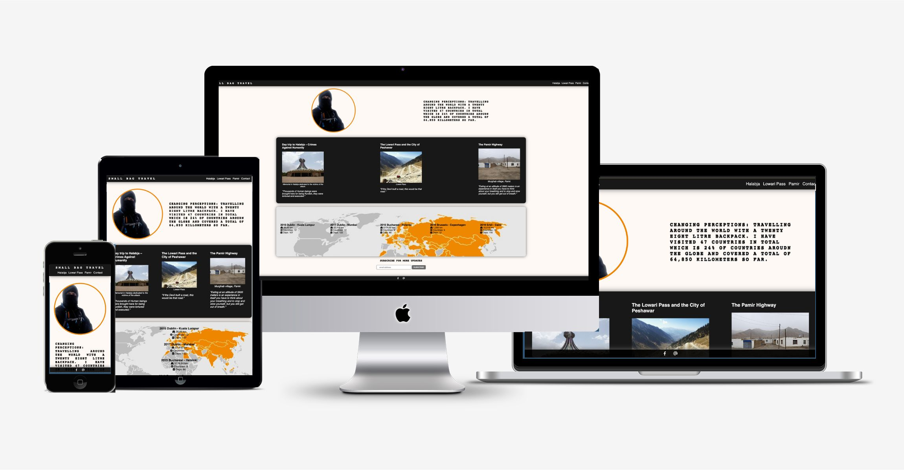
[Small Bag Travels](https://oarina.github.io/small-bag-travel/) is a static website designed for an Irish travel blogger. The goal is to highlight to a reader three most intriguing journey recollections and redirect them to a full article so that they can enjoy the bloggers in depth recital of his travels. The website wants to borrow from the style and feel of the Facebook blog so that the blogger's personality can come through.  Reader can also fill the form or subscribe for updates.  
# Table of Contents

<a href="#ux">UX</a>

- [Reader Goals](#reader-goals)
    - [Target readers](#target-readers)
    - [User Goals](#user-goals)
      - [Small Bag Travels Website fills those needs accordingly](#small-bag-travels-website-fills-those-needs-accordingly)
      - [Blogger Goals](#blogger-goals)
- [Blogger Requirement](#blogger-requirement)
- [User Stories](#user-stories)
- [Visual Design](#visual-design)
  - [Wireframes](#wireframes)
  - [Font](#font)
  - [Logo](#Logo)
  - [Icons](#Icons)
  - [Colours](#Colours)
  - [Stylig](#Features)

<a href="#features">Features</a>

 - [Navbar](#navbar)
- [Footer](#footer)
 - [Intro Section](#intro-section)
 - [Article snippets](#article-snippets)
 - [Trip section](#trip-section)
 - [Articles](#articles)
 - [Form](#form)

<a href="#tech">Tech</a>

 - [Technologies Used](#technologies-used)
 - [Libraries](#libraries)
 - [Platforms](#platforms)
 - [Testing](#testing)
 - [Bugs](#bugs)
     - [Contact](#contact)
      - [Credits](#credits)

# UX
## Reader Goals

### Target readers
* Users who are subscribed to Small Bag Travel Facebook Page and want to enjoy Brian's story in an in-depth and focused format.
* English speaking viewers that are interested in current affairs and are looking for an impartial source of information around heavily politicised topics and locations around the world.
* People who enjoy a story of overcoming or navigating a dangerous situations in an unknown environment.

### User Goals

* Read through one or all of the stories.
* Ease of use
* Subscribe to blogger for updates.
* Fill a form to reach out to the blogger.
* Ejoy a low-key non-intrusive content but also have the option to find Brian if user wishes so.

#### Small Bag Travels Website fills those needs accordingly

 *  Website has a minimalist feel with sharp contrast.
 *  The hero section of the blog presents the blogger's image without a background and blends it into a faint off-white background with a message that blogger wants to convey.
 * Shortly after three articles chosen by the blogger that presented and for the ease of use with an image and a snippet from the article. Image, heading, citation and a snippet from a blog are all clickable. That way if a user is interested they can intuitively click on any part they like and be swiftly redirected to the story.
 * The header and footer are sticky but not huge or intrusive. This will allow a reader to have easy access to the bloggers email, Facebook Page, Form, Hero page and other articles at their finger tips.
 * At the same time the blogger's approach of focusing on content itself in a non-commercial and impartial manner is respected.
 * Extra consideration was made.

 ### Blogger goals
 * To display the longer format information and capture more audience.
 * To continue honing on the blog value proposition and zeroing in on a niche style and format. 
 * To Highlight the achievements made so far and show-off key material in detail that is not covered in Small Bag Travel Facebook Page.
 * To capture and connect with readers who specifically like longer writing format style. 

 ### Blogger requirement
 * Blogger provides the visual material, captions to visual material, article text and travel information along with dates. Blogger specifically wants information to be presented as is - in an untampered state.

## User Stories

1. **Break from social.** As a user who is already subscribed to the Small Bag Travel Facebook page and follow the blogger, I want to have a centralised platform to read about about Small Bag Travel in one place.  I prefer this over browser and click through multiple posts and expand wrapped text on a Facebook Page. I can get overwhelmed with busy, distracting social space that has a lot of advertisement and call to action content. I want a clean, user friendly, easy navigation bar and content without distractions.

0. **Independent thinker.** As a user who is interested in history and politics, I seek an impartial account of what is actually like on the ground at various locations. I want to find a reliable source to form my own opinions. I already know the material and details associated with certain locations and events and appreciate an unbiased account of an individual in that location. I am interested in reading through material that avoids political slant or a hyperbole, but instead includes info like locations, dates, miles, headcount and other relevant data. This unique insight alows me to picks relevant specific info for my own opinion. 

0. **Vicarious traveller.** As a user who is interested in justice and humanitarian causes, I would like to vicariously travel to various locations and connect with the people of interest. I am particularly drawn to the original images and stories about the blogger interacting with locals. I want to easily access to contact information from any part of the website, but without it interferering with my reading experience. Additionally, I appreciate the inclusion of non-profit organisations like UNICEF, visiting of memorial sites and hearing ground-level stories about them presented without sensationalism. 

0. **Fellow solo traveller.** As a user who is interested in long-distance solo minimalist travel with political and humanitarian inclinations, I want to be inspired while also being able to plan ahead for my own journeys. I am looking for a quick introduction to the blogger first, including their achievements and the locations they have traveled to. I am particularly drawn to an engaging introduction and a map that provides a quick breakdown of their trips. Additionally, I want the ability to easily subscribe for updates and stay connected.

0. **Detail oriented traveller.** As user who wants to travel to the destination mentioned and want to gather extra details to prepare for the journey better. There is lots of info I can find online about journeys and trips, but I particulary want to check for unforseen details that will help me in my journey, like taking extra food or exersising prior to manage eating in high altitute. I want to get in touch with the blogger directly and ask for specific information if I want to. 

0. **A curious local**. As a user who's location the blog has mentioned, I am interested in seeing what is written about my culture. I will access the website from various devices and want to be able to easily read it from many device types. 

## Visual Design

### [Wireframes](https://drive.google.com/drive/folders/1iBsT9Lnh8ctsGGqr66pS5sxqGruHK3Ja?usp=sharing)

### Font

* Primary Font - [Anton](https://fonts.google.com/specimen/Anton). Bold and strong font that is going on the logo and all the headings. Fallback is monoscape as it is takes up a similar size to Anton which should not interfere with text layout in containers and it is equally as strong. 
* Secondary Font - [Open Sans](https://fonts.google.com/specimen/Open+Sans). Light and gentle to contrast with the strong font. Fallback is Sans Serif as it is one of the lighter browser safe fonts.

### Logo

* Logo is borrowed from the Facebook Page and is kept in text format to honor the original source. To give it pop - it is styled in Anton or monoscape while distinguished with a sharp color contrast and uppercase styling. 

### Icons

* Icons are taken from fontawesome.com and are perfectly fitting into the page as is. Since the primary colour is either black and white, only the bottom footer icons needed changing to white colour. Icons help break up the text and convey information with a visual language, especially in the world map section where stats need to be displayed.

### Colours

* Image of the blogger and a map were both inherited images that are positioned on the front page. Extrapolating from those colours black in contrast with white fit the serious feel of the topic while both map and an item on bloggers back had an orange colour present. It made sense to use that colour as a contrast with black. 
* To tie things together buttons and links also change colour to orange. The menu item also lets you know in orange what page you are on. 
* The body of the website has a very faint off-white colour that has a light touch of orange to pair it with the active page, map and a rim around the blogger.
* To elevate the elements, I am using a grey shading that gently disperses around the edges of footer, header and page sections. This gives the items a little pop while also keeping them small and discrete.
* Test is either white on black or black on white or off white. This give maximum readibility while touches like submit buttons hight up in orange. 
* I have also added the same shading of grey around the submit and subscribe buttom to activate only when the button is clicked so that it is clear to the user that they have definitely clicked the button giving them an illusion of an extra dimension. 

### Styling 

* Main focus is to attract the user to the intro and the sample material. I have made every part of an article introductory snippet section ,(image, heading, caption and text), clickable. So that the user can intuitively click on what they like and get there. 
* Also header and footer are both present in all pages at all times so that the user never needs to scroll to the top or bottm. However, the choice is to keep both header and footer small and minimal so that it would not distract from reading the content. 
* The shadow pop - takes away the edginess of the harsh black and white colour layout. 
* Header logo and menu items are designed to collapse onto each other to accomodate for a mobile phone. 
* Even though, majority of the userbase is so far is in Ireland, extra accomodation has been made to keep in mind that old and new, small and big devices can review this content from different countries. 
* Design is mobile first. All the content can easily sit in a small 5 or 6 inch screen on both IOS and Android. This is also where the header and footer are more useful since the user will navigate easiy no matter where they are on the website. 

# Features

## Navbar
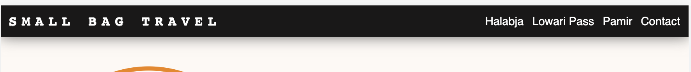

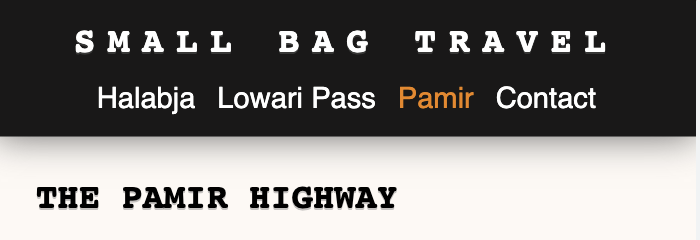

* Navbar is minimalist with a light shade and as the image shrinks navigation menu items collapse under the logo. 
* When you are on an article page - it will be shown in bright orange colour so that you are aware where you are at all times.
* Header and footer are not exactly black, so as you are scrolling through content there will be a faint silouette going under the header and the footer - it offsets the harshnes of just black and feels a little bit more mysterious and classy.

## Footer
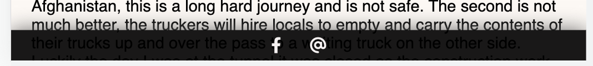

* Tucked away it is discretely always sitting at the bottom. User has access to two provided contacts - Facebook Page and an email. Like navigation bar it will light up orange if you click on it. 

## Intro Section
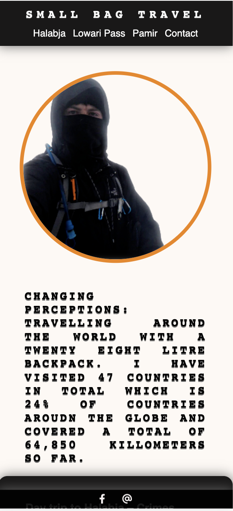
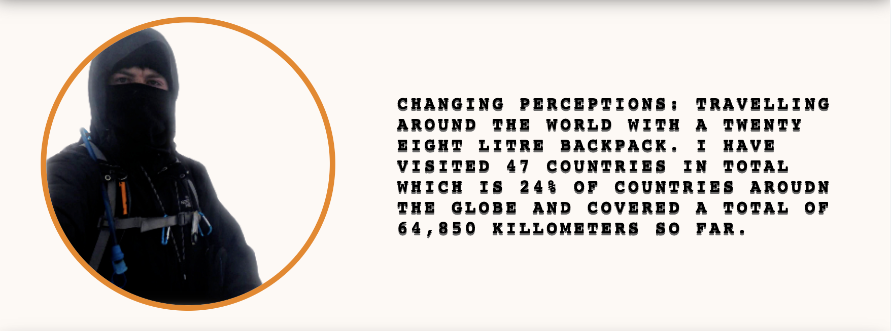

* Intro was designed with mobile in mind first, however, the bloggers image and the slogan that is the heart of the blog comfortably fits in either screen. 
* The message sits under the blogger in a mobile, but in a desktop it would be horizontal instead. 
* Minimalist orange accent around the blogger is chosen to accentuate the main character. The slogan is styled togethe with a logo and is the boldest text on a page. 

## Article snippets

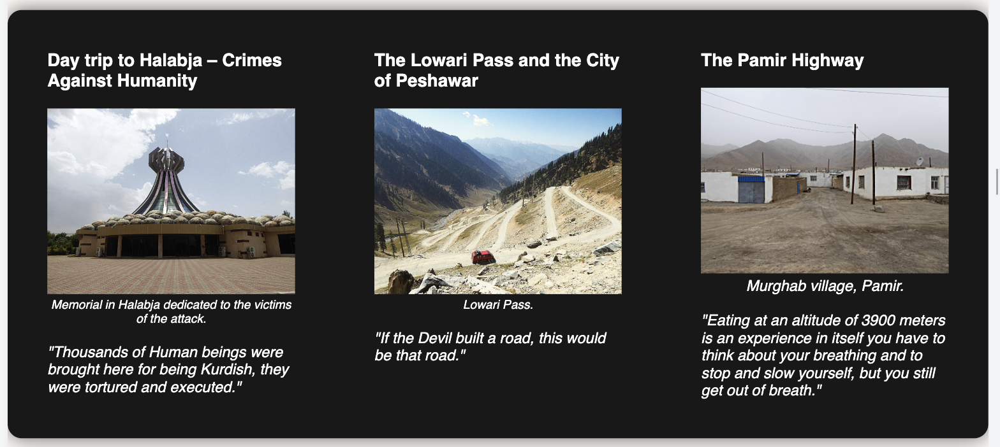
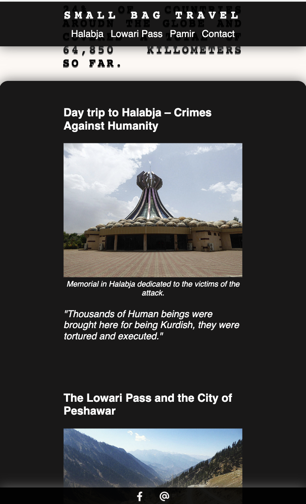

* Article snippet/teaser section wants to distinguish itself from the above and attract attention. That is why it is white on black. When it collapses for mobile it retains the continued shape from the collaped header items. This will make it more seamless and put together, while you can still feel the scrolling as text falls under the header and footer.
* Every single item inside the snippet is clickable so you can intuitively jump to the article of choice.

## Trip section

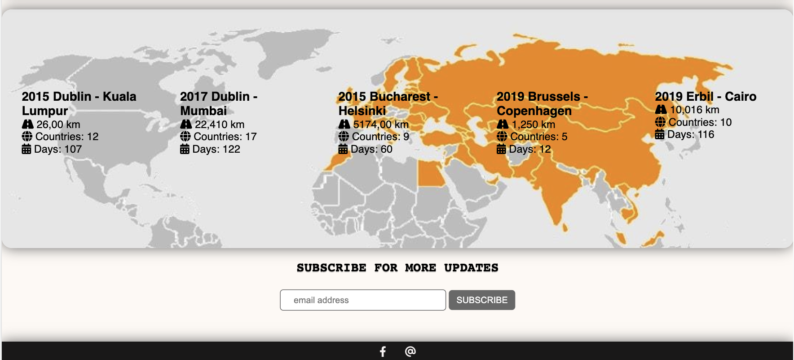
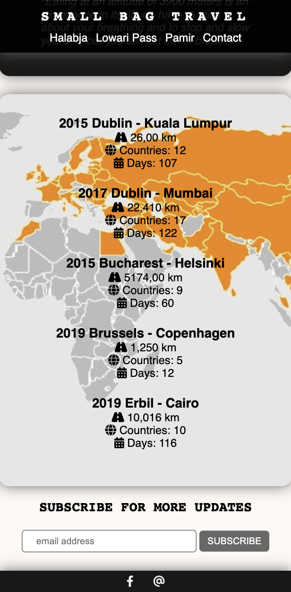

* This section is aiming to maximise the provided image of all the countries that blogger has visited. Those are in orange. 
* Section is separated into 5 parts that give light stats to the previous trips made by the blogger acompanied with icons for easier readability. 
* It is now back to black font on off-white which pops the light statistics in this section.
* The backround image is set so that when on mobile device the zoom will occur on the orange countries that blogger visited.

## Articles
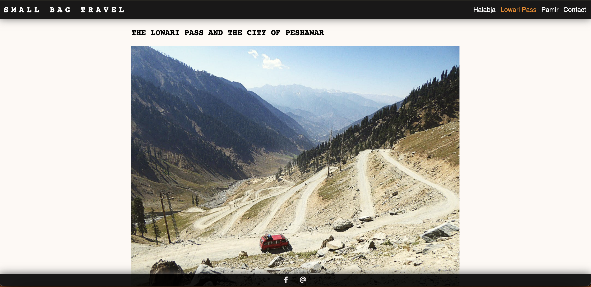
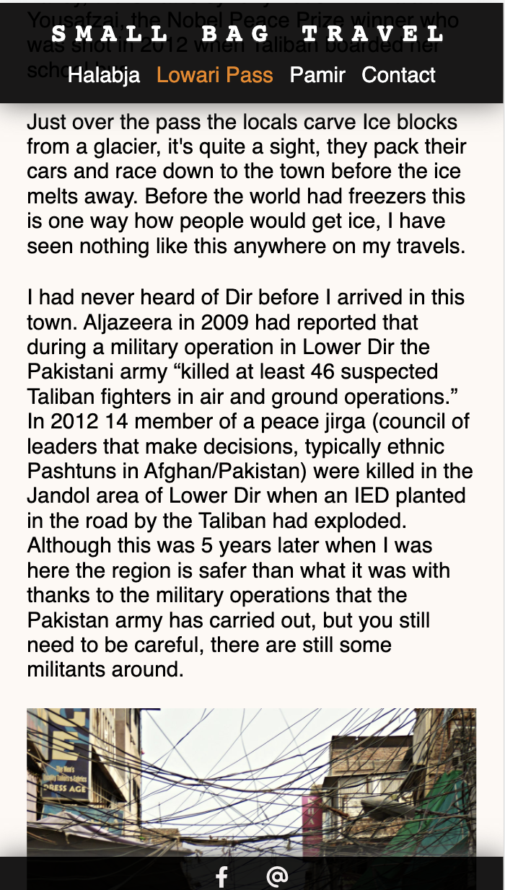

* Article section is kept simple. Images and text all lign up with each other and the artice only has one size when in ladscape mode that is not too wide. It should strain the eyes less if the eye can go onto the next page sooner.
* Article also tries to fill in as much of a page as possible when on mobile trying to utilise as much space as possible without being too crammed. 

## Form
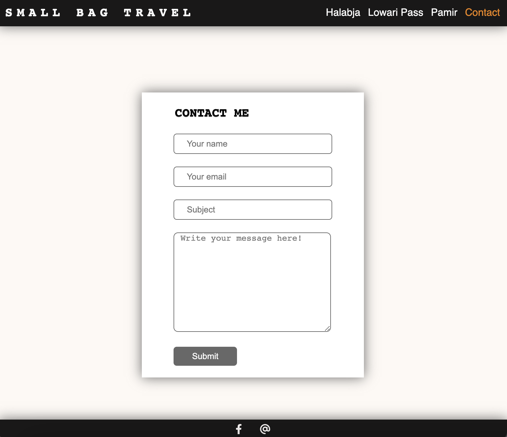
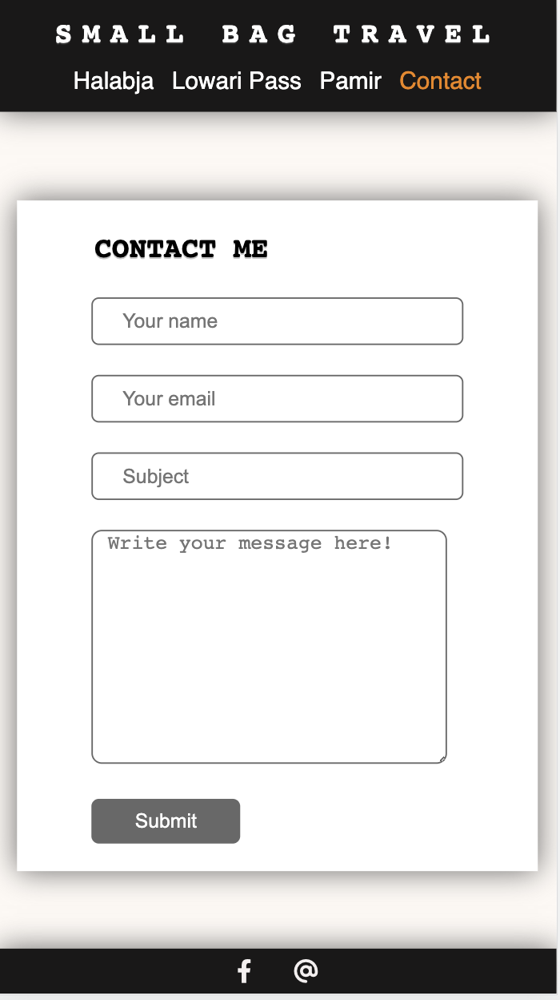

* I have kept the form wiht as little boxes to fill as possible, however, email, name and message boxes are requred so you could not send an empty form. 
* This page is also intentionally kept minimalistic and only the form is in the centre of a page no matter what device you will have. 
* With nothing but the form the aim is to minimise distractions and help the user fill the form fast easy and then witht he header and footer at the finger tips - the user can get back to what they were previously doing.

# Tech 

##  Technologies Used 
* HTL 
* CSS 

## Libraries
* fontawesome
* Google Font

## Platforms 
* Codeanywhere 
* VS Code both native and cloud

## Testing 
* Validated by both W3C HTML5 Validator and W3C CSS Validator 
* Tested in DevTools and on Iphone DE, Samsung Table, Apple Ipod, OpePlus phone and Macbook Pro. 
* Site was shared with friends and family for further testing and feedback.
* Each link, button and feature were checked in the above devices and environments horizontally and vertically. 

## Bugs
* Mobile IOS devices do not load Anton font correctly. 
* Google Dev Tools screenzise simulator does not give the same results as the actual device.

### Contact
* arinkaheaven@gmail.com

### Credits
* Blog content is an original brainchild of Brian O'Connor who is the admin of the original Small Bag [Travel Facebook Page](https://www.facebook.com/SmallBagTravel).

<!--Granted logo from CSS validator-->

    

