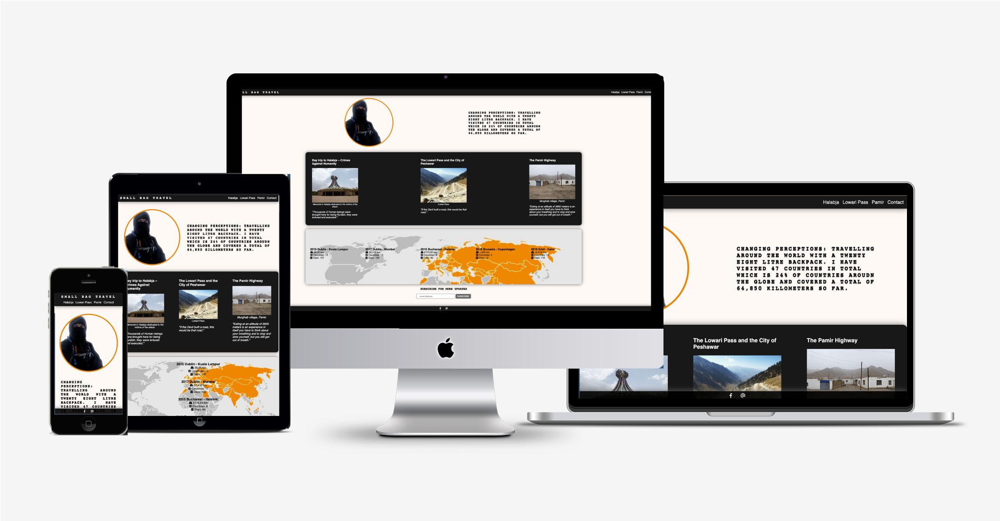

<!--Granted logo from CSS validator-->

[Small Bag Travels](https://oarina.github.io/small-bag-travel/) is a static website designed for an Irish travel blogger. The goal is to highlight to a reader three most intriguing journey recollections and redirect them to a full article so that they can enjoy bloggers deeper recital of his travels. The website wants to borrow from the style and feel of the Facebook blog so that blogger's personality can come through.  Reader can also fill the form or subscribe for updates.  
# Tble of Contents

# UX
## Goals
### Reader Goals

Target readers:
* Users who are subscribed to Small Bag Travel Facebook Page and want to enjoy Brian's story in an in-depth and focused format.
* English speaking viewers that are instersted in current affairs and are looking for an impartial cource of information around heavily politicised topis and locations around the world.
* People who enjoy a story of overcoming or navigating a dangerous situation in an unknown envifonment.

User Goals:

* Read through one or all of the stories.
* Ease of use
* Subscribe to blogger for updates.
* Fill a form to reach out to the blogger.
* Ejoy a low-key non-intrusive content but also have the option to find Brian if user wishes so.

Small Bag Travels Website filles those needs accordingly:

 *  Website has a minimalist feel with sharp contrast.
 *  The hero section of the blog presents the blogger's image without a background and blends it into a faint off-white background with a message that blogger wants to convey.
 * Shortly after three articles chosen by the blogger that presented and for the ease of use with an image and a snippet from the article. Image, heading, citation and a snippet from a blog are all clickable. That way if a user is interested they can intuitively click on any part they like and be swiftly redirected to the story.
 * The header and footer are sticky but not huge or intrusive. This will allow a reader to have easy access to bloggers email, Facebook Page, Form, Hero page and other articles at their finger tips.
 * At the same time blogger's approach of focusing on content itself in a non-commercial and impartial manner is respected.
 * Extra consideration was made

### User Stories:

1. **Break from social.** As users who is already subscribed to the Small Bag Travel Facebook page and follow blogger, I want to have a centralised platform to read about about Small Bag Travel in one place.  I prefer this over browser and click through multiple posts and expand wrapped text on a Facebook Page. I can get overwhelmed with busy, distracting social space that has a lot of advertisement and call to action content. I want an clean, user friendly, easy navigation bar and content without distractions.

0. **Independent thinker.** As user who is interested in hostory and politics, I seek an impartial account of what is actually like on the ground at various location.s I want to find a reliable source to form my own opinions. I already know the material and details associated with certain locations and events, and appreciate an unbiased account of an individual in that location. I am interested in reading through material that avoids political slant or a hyperbole, but instead includes info like locations, dates, miles, headcount and other relevant data. This unique insight alows me to picks relevant specific info for my own opinion. 

0. As user who is interested in justice and humanitarian causes and would like to vicariously travel to the locations and connect with the people of interest.

0. As user who is interested in long disstance solo minimalist travel with political and humanitarian inclinations and wants to be inspired.

0. As user who wants to travel to the destination mentioned and want to gather extra details to prepare for the journey better.

0. 

# Testing 

## Bugs

    

